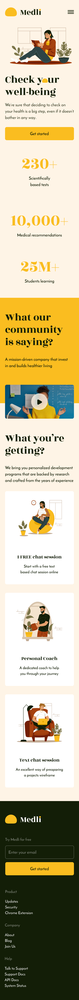

# Daftcode - recruitment task

### How to run

1. Clone this repo.
2. ```
   npm install
   ```
3. ```
   npm start
   ```
4. Open `localhost:3000` in your browser

### View For Desktop 1440px


### View For Mobile 375px



